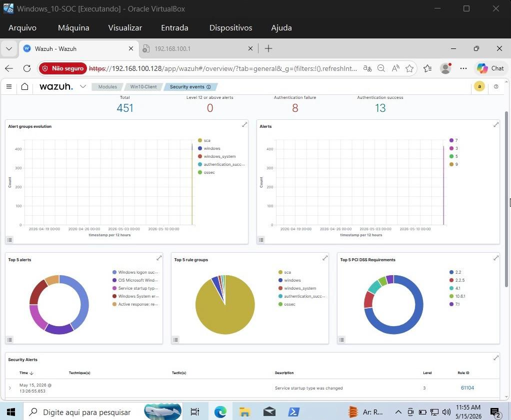
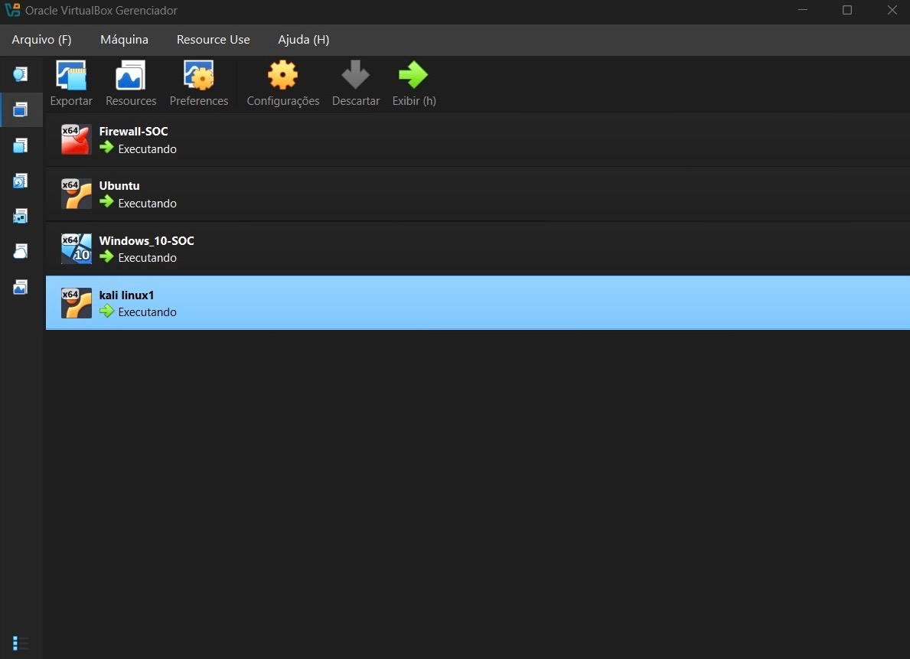
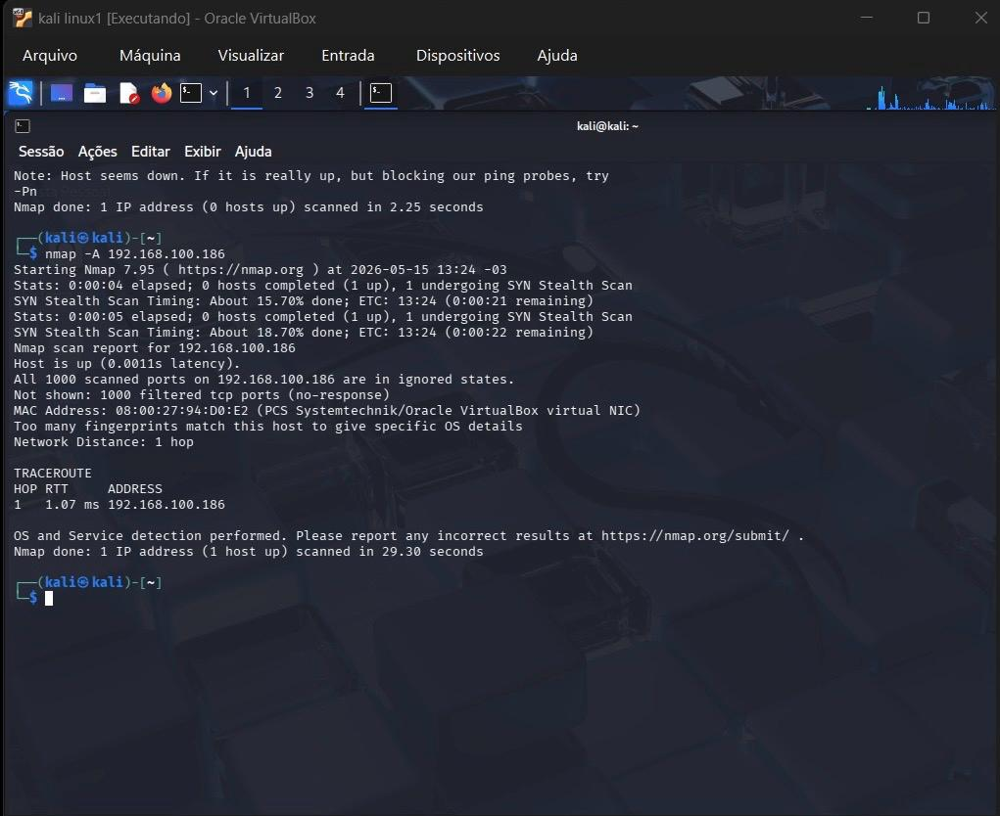
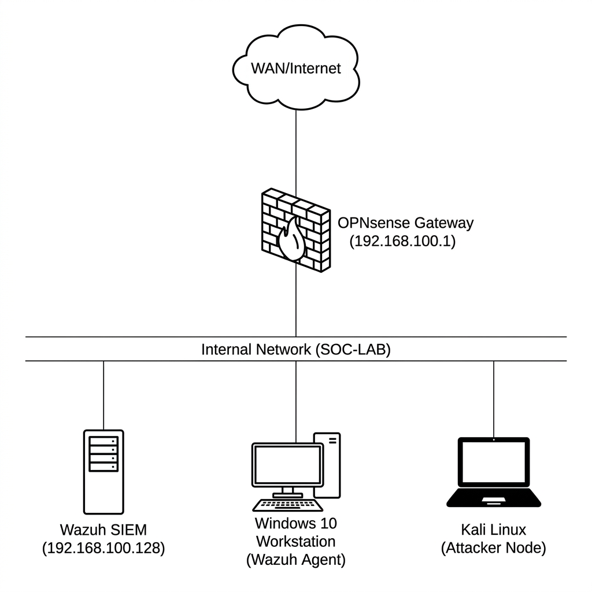

# Home SOC Lab – Security Monitoring & Threat Detection

<p align="left">
  
  
  
  
</p>

## Objetivo
Construir um ambiente defensivo capaz de centralizar logs, monitorar eventos de segurança e detectar atividades suspeitas em uma rede segmentada utilizando ferramentas SIEM e análise de telemetria.

## Ambiente
O laboratório foi desenvolvido com foco em práticas de **Blue Team**, monitoramento defensivo e simulação de atividades maliciosas em ambiente controlado e isolado.

## Fluxo de Monitoramento
```text
[Kali Linux] ---> [OPNsense Firewall] ---> [Windows 10 Endpoint] ---> [Wazuh SIEM]
```

## Implementações Atuais
- **Deploy automatizado** do stack Wazuh no Ubuntu Server.
- **Registro do agente** Windows no SIEM para coleta de telemetria.
- **Configuração de Gateway** seguro via OPNsense para segmentação de tráfego.
- **Validação de comunicação** entre endpoints e dashboard centralizado.

## Tecnologias Utilizadas
- **SIEM:** Wazuh (Indexer, Server, Dashboard).
- **Firewall:** OPNsense.
- **Servidor:** Ubuntu Server 22.04.
- **Atacante:** Kali Linux (Nmap e Simulação de Atividades Maliciosas).
- **Vítima:** Windows 10 (Monitoramento via Agente).
- **Virtualização:** Oracle VirtualBox.

## Casos de Detecção
- **Network scanning via Nmap:** Identificação de varreduras ativas.
- **Falhas de autenticação Windows:** Detecção de tentativas de intrusão.
- **Eventos de segurança do Windows:** Auditoria de logs de sistema.
- **File Integrity Monitoring (FIM):** Monitoramento de alterações em arquivos críticos.

## Evidências

### Painel Geral de Operações (Wazuh)
*Visão unificada de eventos de segurança e correlação de alertas em tempo real.*


### Infraestrutura das Máquinas Virtuais
*Ambiente virtualizado com instâncias isoladas para simulação e defesa.*


### Detecção de Reconhecimento de Rede
*Identificação de varredura de portas (Nmap) originada do Kali Linux.*


### Topologia e Arquitetura da Rede
*Segmentação de interfaces e fluxo de comunicação entre ativos.*


## Melhorias Futuras
- Integração com **Sysmon** para auditoria avançada.
- Criação de **Regras customizadas** no Wazuh.
- Integração com **Suricata IDS**.
- Implementação de **Active Directory**.
- Mapeamento completo via **MITRE ATT&CK Mapping**.

---
**Status:** Finalizado ✅  
**Desenvolvedor:** Leonardo Luiz Eboli


